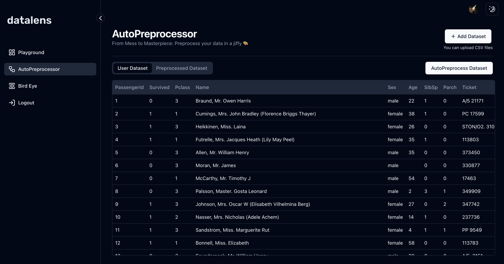

# DataLens

DataLens is a powerful online tool designed to streamline the preprocessing of datasets and provide detailed visualizations and comprehensive reports with minimal effort. Whether you're an analyst, data scientist, or someone looking to simplify data preparation, DataLens makes it quick and easy to get your data analysis-ready.

## Features

### 1. AutoPreprocessor: Simplify Data Processing

Transform your CSV files with a single click. AutoPreprocessor streamlines data preparation, making it quick and easy to get your data analysis-ready.

### 2. BirdEye: Uncover Insights Instantly

With BirdEye, upload your CSV and receive detailed visualizations and comprehensive reports in seconds. Get actionable insights quickly and efficiently.

## Screenshots

### Playground Overview



## Tech Stack

- **Frontend:** Next.js, ShadCN, TailwindCSS
- **Backend:** Flask
- **Authentication:** Clerk

## Getting Started

1. Clone the repository:

   ```bash
   git clone https://github.com/yourusername/datalens.git
   ```

2. Navigate to the project directory:

   ```bash
   cd datalens
   ```

3. Install dependencies:

   ```bash
   # Frontend
   cd frontend
   npm install

   # Backend
   cd ../backend
   pip install -r requirements.txt
   ```

4. Start the development server:

   ```bash
   # Frontend
   npm run dev

   # Backend
   flask run
   ```

## License

This project is licensed under the Apache-2.0 License - see the [LICENSE](LICENSE) file for details.

## Contributors

- [Rishabh Gupta](https://github.com/R1shabh-Gupta)
- [Suhrud Joshi](https://github.com/Suhrud1511)
